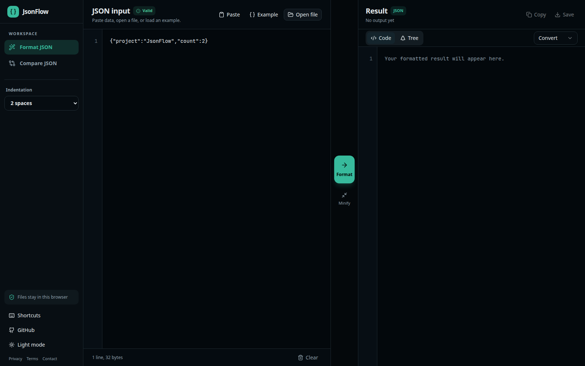
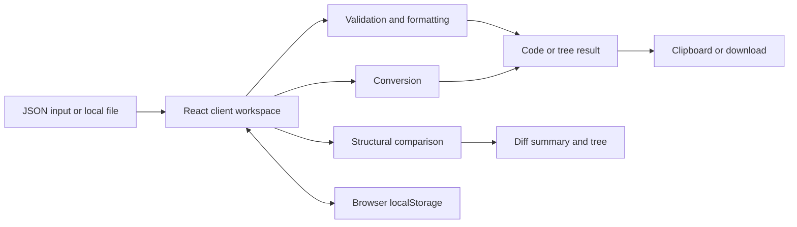

# JsonFlow

> A focused browser workspace for formatting, validating, comparing, and converting JSON.

[](https://jsonflow.netlify.app)
[](https://www.supportkori.com/montasim)

JsonFlow gives developers a fast, distraction-free alternative to moving JSON through a server-backed utility. The V2 interface uses the available screen width for a persistent input, action rail, and result inspector, with a separate structural comparison workspace.

**[Open the live app](https://jsonflow.netlify.app) · [Report an issue](https://github.com/montasim/JsonFlow/issues)**

> **Project status:** V2 is implemented on the `v2` branch. The public deployment follows the repository's configured deployment branch and may not show this interface until V2 is deployed. This repository currently has no automated test suite, CI workflow, or license file.

[](https://jsonflow.netlify.app)

## Features

### Format workspace

- Validate JSON as you type and surface useful parse errors
- Format with 2, 4, or 8 spaces or tabs, or minify to one line
- Paste, load an example, drag and drop, or open a local `.json` file
- Inspect formatted JSON as syntax-highlighted code or an expandable tree
- Convert JSON to YAML, XML, CSV, or plain text
- Copy or download generated results
- Track line and byte counts without leaving the editor

### Compare workspace

- Compare two JSON documents side by side
- Identify added, removed, modified, and type-changed values
- Review a compact summary and expandable difference tree
- Configure key order, array, sorting, and text-case behavior
- Format either document independently before comparing

### Interface

- Responsive desktop and mobile workspaces
- Light and dark color modes
- Keyboard shortcuts for frequent actions
- Browser-local persistence for recent work and preferences
- Consistent shadcn controls and Lucide icons

## Use JsonFlow

1. Open the format workspace and paste JSON, choose **Example**, or open a `.json` file.
2. Select an indentation style, then choose **Format** or **Minify**.
3. Inspect the result in code or tree view, or choose a conversion format.
4. Copy or save the generated result.
5. Open **Compare JSON** to find structural differences between two documents.

### Keyboard shortcuts

Use `Cmd` instead of `Ctrl` on macOS.

| Workspace | Shortcut | Action |
| --- | --- | --- |
| Format | `Ctrl+Enter` | Format valid JSON |
| Format | `Ctrl+Shift+M` | Minify valid JSON |
| Format | `Ctrl+S` | Download the current result |
| Compare | `Ctrl+Enter` | Compare valid documents |
| Compare | `Ctrl+Shift+L` | Format the left document |
| Compare | `Ctrl+Shift+R` | Format the right document |
| Compare | `Ctrl+Shift+X` | Clear both documents |

## Privacy and data storage

Formatting, validation, comparison, and conversion run in browser-side React components. This repository contains no application API route that receives JSON input.

JsonFlow uses browser `localStorage` to retain the selected theme and indentation, recent formatter input, comparison documents, and comparison options. Clear the relevant editors or the site's browser storage to remove retained content. Browser extensions, hosting infrastructure, clipboard access, and downloaded files remain outside the application's processing boundary.

Avoid pasting credentials, private keys, regulated records, or other sensitive content into any public web utility you have not independently reviewed.

## Local development

### Prerequisites

- Node.js 20.9.0 or newer
- pnpm 11.7.0 or a compatible release

```bash
git clone https://github.com/montasim/JsonFlow.git
cd JsonFlow
git switch v2
pnpm install
pnpm dev
```

Open <http://localhost:3000>.

## Configuration

The workspaces require no environment variables. Optional public metadata values are documented in [`.env.example`](.env.example):

| Variable | Purpose |
| --- | --- |
| `NEXT_PUBLIC_APP_NAME` | Public product name |
| `NEXT_PUBLIC_APP_URL` | Canonical public URL |
| `NEXT_PUBLIC_CONTACT_EMAIL` | Public contact address |

```bash
cp .env.example .env.local
```

## Commands

| Command | Purpose |
| --- | --- |
| `pnpm dev` | Start the development server |
| `pnpm build` | Create an optimized production build |
| `pnpm start` | Serve the production build |
| `pnpm lint` | Run ESLint |
| `pnpm typecheck` | Check TypeScript without emitting files |

No automated test command is currently defined.

## Architecture



There is no JsonFlow application server in the transformation path. Next.js statically prerenders the routes, while client components perform interactive work in the browser.

## Technology

- Next.js 16.3 and React 19.2
- TypeScript 5
- Tailwind CSS 4.3
- shadcn 4.16 with Radix UI primitives
- Lucide icons
- js-yaml for YAML conversion

## Project structure

| Path | Purpose |
| --- | --- |
| `app/` | Routes, metadata, fonts, and global theme tokens |
| `components/workspace-shell.tsx` | Responsive navigation and shared application shell |
| `components/code-editor.tsx` | Tailwind-native JSON input and result surface |
| `components/json-converter.tsx` | Formatting, conversion, and export workflow |
| `components/json-compare.tsx` | Two-document comparison workspace |
| `components/json-tree-view.tsx` | Expandable JSON tree presentation |
| `components/ui/` | shadcn UI primitives |
| `lib/json-utils.ts` | Parsing, validation, formatting, and minification |
| `lib/json-conversions.ts` | YAML, XML, CSV, and text conversion |
| `lib/json-compare.ts` | Structural comparison logic |
| `prototypes/v1/`, `prototypes/v2/` | Preserved design prototypes |

## Deployment

The current public application is hosted on Netlify at [jsonflow.netlify.app](https://jsonflow.netlify.app). A production deployment should install with pnpm, run `pnpm build`, and configure any public metadata values required by the target environment.

## Limitations

- The formatter rejects uploaded JSON files larger than 10 MB; large pasted documents are still constrained by browser memory and responsiveness.
- Recent inputs are retained in the browser until cleared, as described above.
- CSV conversion serializes structures that cannot be represented directly in a flat table; review nested output before reuse.
- Generated XML and CSV should be validated against the consuming system's schema and escaping requirements.
- There is no automated test suite or CI workflow.
- The repository has no dedicated security policy, contribution guide, or code of conduct.

## Contributing

Issues and focused pull requests are welcome. Run the following checks before submitting:

```bash
pnpm lint
pnpm typecheck
pnpm build
```

Add tests when introducing a test harness or changing transformation behavior.

## Support and security

Use [GitHub Issues](https://github.com/montasim/JsonFlow/issues) for reproducible bugs and proposals. Never include sensitive JSON or credentials in a public issue.

No private vulnerability-reporting process is documented. Contact the maintainer before public disclosure when possible.

## Funding

Support continued maintenance through [SupportKori](https://www.supportkori.com/montasim). Bug reports, documentation, and focused code contributions are also valuable.

## Author

Built and maintained by [Montasim](https://github.com/montasim).

## License status

No license file is included. Source visibility does not grant permission to copy, modify, or redistribute this project.
